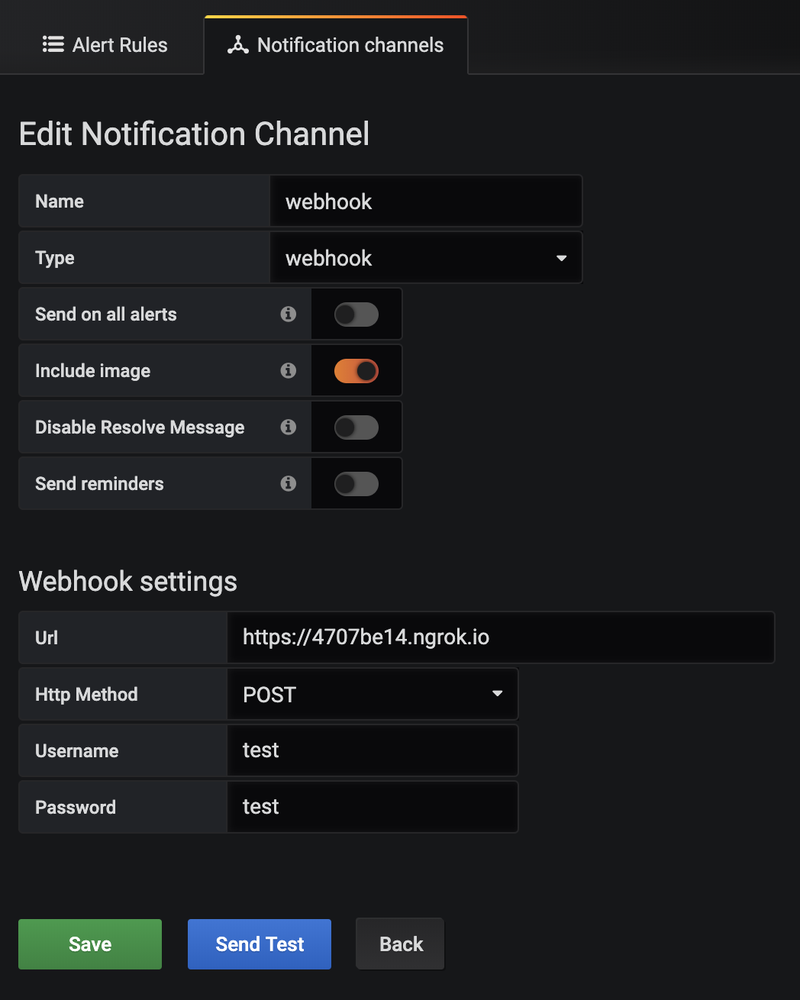

# =grafana-telegram-proxy=
sending Grafana alarm messages to Telegram via the Webhook channel

[](https://travis-ci.org/maslick/grafana-telegram-proxy)
[](https://hub.docker.com/r/maslick/grafana-telegram-proxy)
[](https://opensource.org/licenses/MIT)


## Features
* Sends Grafana alarm messages to Telegram via the Webhook channel
* Lightweight static binary: ~2.5 MB zipped
* Cloud-native friendly: Docker + k8s
* Secure: Basic authentication (optional)



## Installation
```zsh
$ go test
$ go build -ldflags="-s -w"

$ go build -ldflags="-s -w" && upx grafana-telegram-proxy
```

## Usage
* Without authentication:
```zsh
$ export BOT_TOKEN=1234567890abcdef
$ export CHAT_ID=-12345
$ ./grafana-telegram-proxy
Starting server on port 8080 ...
```

* With Basic authentication:
```zsh
$ export BOT_TOKEN=1234567890abcdef
$ export CHAT_ID=-12345
$ export USERNAME=maslick
$ export PASSWORD=12345
$ export PORT=4000
$ ./grafana-telegram-proxy
Starting server on port 4000 ...
```

## Docker
```zsh
$ docker build -t maslick/grafana-telegram-proxy .
$ docker run -d \
   -e BOT_TOKEN=1234567890abcdef \
   -e CHAT_ID=-12345 \
   -p 8081:8080 \
   maslick/grafana-telegram-proxy

$ docker run -d \
   -e BOT_TOKEN=1234567890abcdef \
   -e CHAT_ID=-12345 \
   -e USERNAME=maslick \
   -e PASSWORD=12345 \
   -p 8082:8080 \
   maslick/grafana-telegram-proxy

```

## Kubernetes
```zsh
$ kubectl apply -f k8s
$ kubectl set env deploy grafana-telegram-proxy \
   BOT_TOKEN=1234567890abcdef \
   CHAT_ID=-12345 \
   USERNAME=maslick \
   PASSWORD=12345
```
